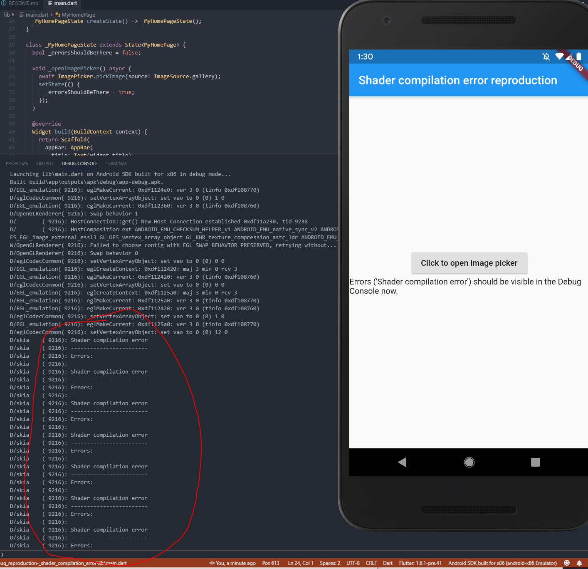

# shader_compilation_error

This is a minimal reproduction of a "Shader compilation error" that is occuring for me in VS Code when working with Flutter.

It happens at a lot of places for me. I'm taking the `image_picker`-dependency for demonstration here just because it's the most reliable way of reproducing this for me.

Flutter doctor:
```
flutter doctor
Doctor summary (to see all details, run flutter doctor -v):
[√] Flutter (Channel master, v1.6.1-pre.41, on Microsoft Windows [Version 10.0.17134.765], locale de-DE)
[√] Android toolchain - develop for Android devices (Android SDK version 28.0.3)
[!] Android Studio (version 3.1)
    X Flutter plugin not installed; this adds Flutter specific functionality.
    X Dart plugin not installed; this adds Dart specific functionality.
[√] VS Code, 64-bit edition (version 1.33.1)
[√] Connected device (1 available)

! Doctor found issues in 1 category.
```


